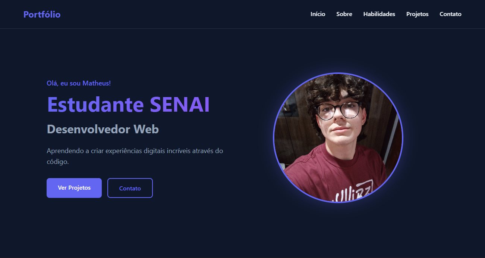

# 🚀 Meu Portfólio

### 🖼️ Preview do Projeto

> 🎨 **Design System**: Tema escuro com accent em indigo/violet

 

## 📋 Sobre o Projeto

Portfólio pessoal desenvolvido para apresentar meus projetos, habilidades e experiência como desenvolvedor front-end. O site possui design moderno, dark theme e carrossel interativo de projetos.

### ✨ Funcionalidades

- 🎨 **Design Responsivo** - Adaptável a todos os dispositivos
- 🌙 **Tema Escuro** - Interface moderna com cores sóbrias
- 🎠 **Carrossel 3D** - Navegação interativa entre projetos
- ⚡ **Performance** - Carregamento rápido e otimizado
- 🎯 **Animações Suaves** - Transições elegantes com CSS
- 📱 **Mobile First** - Experiência otimizada para smartphones

## 🛠️ Tecnologias Utilizadas

- **React** - Biblioteca JavaScript para construção de interfaces
- **CSS3** - Estilização avançada com variáveis e animações
- **Vite** - Build tool rápida e moderna
- **GitHub Pages** - Hospedagem gratuita e integrada

## 🚀 Como Executar

Pré-requisitos
- **Node.js** (versão 16 ou superior)
- **npm** ou yarn

## Instalação

# Clone o repositório
**git** clone https://github.com/MathConceicion/Portfolio.git
# Instale as dependências
**npm** install
# Execute o servidor de desenvolvimento
**npm** run dev

Feito com 💜 por Matheus Conceicion
⭐ Se gostou do projeto, deixe uma estrela!

